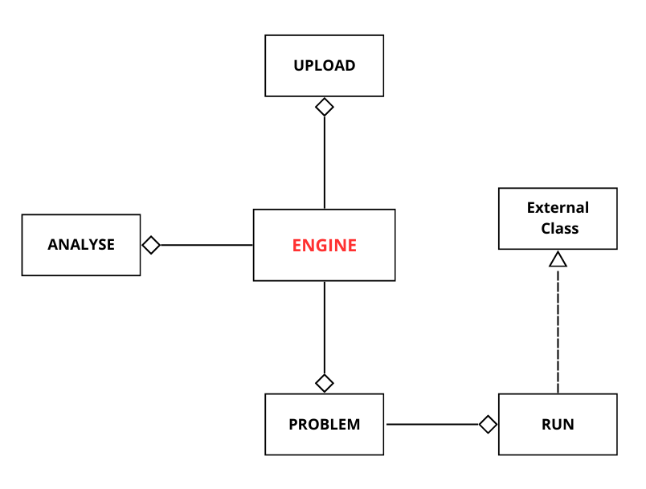

# Evobench
Pacote de software que implementa problemas benchmark de teste para otimização multiobjetivo, com ou sem redundancia de objetivos para análise de soluções de algoritimos evolutivos.
EvoBench está organizado da seguinte forma:

