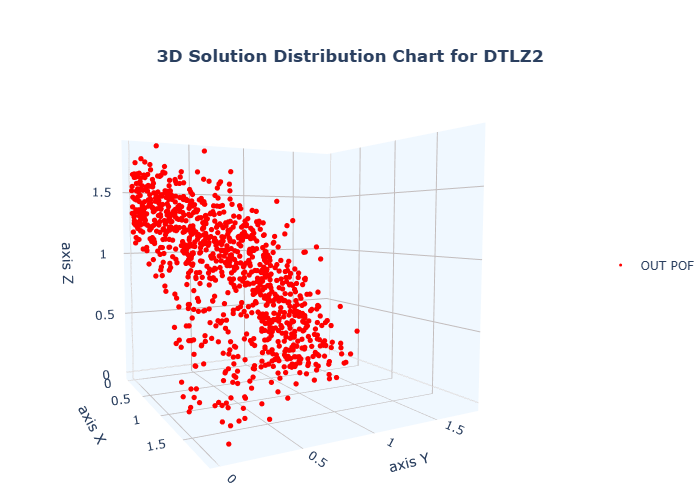

# Amostras dominadas 

## **Método**

O método <strong><i>dtlz2.samples()</i></strong> não altera o vetor <strong><i>| XM |</i></strong>. A finalidade é preservar a <i>maximização</i> da função <strong><i>g( XM )</i></strong>, gerando mínimos locais sobre a verdadeira frente ótima de Pareto. O objetivo desta função é dificultar a resolução do problema pelos algorítimos evolutivos( <strong><i>MOEAs</i></strong> ).

## **Configuração**

O método poasui a seguinte configuração <strong><i>padrão</i></strong>:

<ul style="font-size:17px;">
  <li><strong><i>M</i></strong>( objetivos do problema ) = 3</li>
  <li><strong><i>N</i></strong>( variáveis de decisão ) = 10</li>
  <li><strong><i>K</i></strong>( valor para o tamanho do vetor <strong><i>| XM |</i></strong> ) = 8</li>
  <li><strong><i>P</i></strong>( númetos de pontos / soluções do problema ) = 700</li>
</ul>

O método aceita qualquer configuração de valores para as variáveis do problema, incluindo qualquer número para <strong><i>M</i></strong>.
 

## **Arquivo**

O método gera um arquivo com extensão <strong><i>.XLSX</i></strong> que pode ser utilizado pelas ferramentas de análise de dados do <strong><i>Evobench</i></strong>

## **Figura**

Figura gerada por uma das ferramentas de plotagem de gráficos do <strong><i>Evobench</i></strong>.

## **Amostragem**

Os valores das variáveis de decisão, são gerados de forma randômica respeitando o seguinte critério: <strong><i>0 ≤ xi ≤ 1</i></strong> para <strong><i>i = 1,2 ... N</i></strong>.

<button onclick="window.history.back()" style ="font-size:22px;">←</button>

