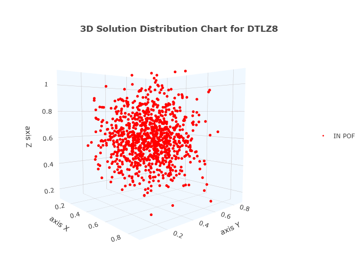

# **Amostras não dominadas**

## **Método**

O método <strong><i>dtlz8.POFsamples()</i></strong> cria uma matriz <strong><i>[ gj(x) , gM(x) ]</i></strong> com o mesmo numero de pontos / soluções de <strong><i>[ M ]</i></strong>. Cada ponto da matriz <strong><i>[ M ]</i></strong> é validada de acordo com a solução equivalente de <strong><i>[ gj(x) , gM(x) ] >= 0</i></strong>. A frente ótima de Pareto gerada é uma restrição aritimética para o problema, e não gera a <strong><i>POF</i></strong> diretamente. Mas fornece o conjunto de restrições necessárias para os algoritimos evolutivos, buscarem todos os conjuntos de soluções possíveis através da evolução de geração, população e mutação.

## **Configuração**

O método poasui a seguinte configuração <strong><i>padrão</i></strong>:

<ul style="font-size:17px;">
  <li><strong><i>M</i></strong>( objetivos do problema ) = 3</li>
  <li><strong><i>N</i></strong>( variáveis de decisão ) = 10</li>
  <li><strong><i>P</i></strong>( númetos de pontos / soluções do problema ) = 700</li>
</ul>

O método aceita qualquer configuração de valores para as variáveis do problema, incluindo qualquer número para <strong><i>M</i></strong>.
 

## **Arquivo**

O método gera um arquivo com extensão <strong><i>.XLSX</i></strong> que pode ser utilizado pelas ferramentas de análise de dados do <strong><i>Evobench</i></strong>

## **Figura**

Figura gerada por uma das ferramentas de plotagem de gráficos do <strong><i>Evobench</i></strong>.

## **Amostragem**

Os valores das variáveis de decisão, são gerados de forma randômica respeitando o seguinte critério: <strong><i>0 ≤ xi ≤ 1</i></strong> para <strong><i>i = 1,2 ... N</i></strong>.

<button onclick="window.history.back()" style ="font-size:22px;">←</button>

